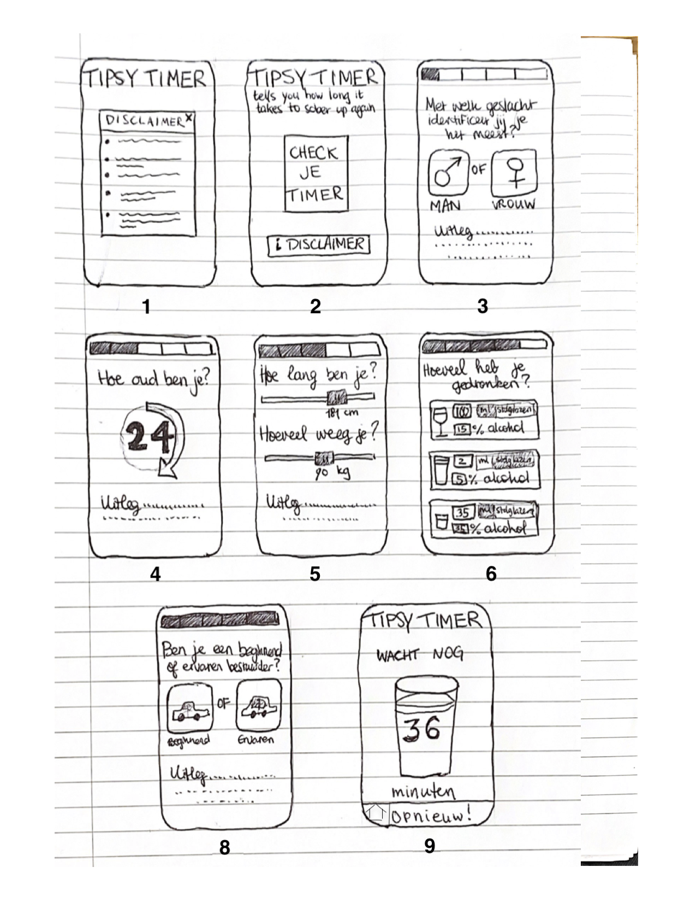

# Nuchter op de weg
## Nina Alblas
Ieder jaar stijgt het aantal ongelukken waarbij alcohol in het spel is ([NOS, 2019](https://nos.nl/artikel/2308458-zorgwekkende-toename-aantal-verkeersdoden-door-alcohol-meer-dan-verdubbeld)) en uit zeer recent onderzoek ([SWOV, 2022](https://swov.nl/nl/nieuws/nederlandse-weggebruikers-europees-perspectief-resultaten-van-het-esra2-onderzoek)) blijkt dat 9,1% van de Nederlandse automobilisten met te veel alcohol op achter het stuur stapt. Mensen gaan er vaak onjuist vanuit dat 'die paar drankjes' niet uitmaken, dat de alcohol in hun bloed inmiddels wel afgebroken zal zijn, of dat een kopje koffie ontnuchtert. Deze foutieve aannames kunnen fatale gevolgen hebben.

De applicatie Tipsy Timer zal het aantal beschonken bestuurders helpen verminderen doordat ze de gebruiker aan de hand van een aantal gegevens, waaronder lengte, gewicht en de genuttigde hoeveelheid standaardglazen, toont hoe lang hij nog moet wachten tot de alcohol in zijn bloed is afgebroken en hij weer veilig de weg op kan.

## Doel van deze applicatie
* Geeft je de tijd in uren waarna de alcohol in je lichaam in zoverre is afgebroken dat de toegestane BAC is bereikt a.d.h.v. een animatie van een leegdrinkend glaasje met een timer erin
* Timer blijft lopen ook als je app sluit
* Geeft een notificatie als de timer afgelopen is

## Schetsen

## Factoren die meegenomen worden bij de berekening van de wachttijd (in uren)
* Leeftijd (in jaren)
* Lengte (in cm)
* Gewicht (in kg)
* Geslacht (man vs. vrouw) - mogelijk voeg ik hier nog iets aan toe betreffende een derde optie
* Alcohol percentage van de genuttigde drankjes
* Hoeveelheid standaardglazen **of** hoeveelheid milliliters
* Rij-ervaring (beginnend vs. ervaren)

## Disclaimers (voorbeelden)
* Deze app mag alleen door mensen van 18 jaar of ouder worden gebruikt
* Gebruik deze app op eigen risico, wij zijn niet aansprakelijk voor de gevolgen
* Vertrouw niet volledig op deze applicatie; laat de beslissing over of je de weg op kunt niet volledig afhangen van het resultaat van je Tipsy Timer.
* Er spelen nog andere factoren mee bij de absorptie en afbraak van alcohol waarmee ook rekening moet worden gehouden, zoals drugs- of medicijngebruik, voeding en fysieke conditie
* Rijden onder invloed is gevaarlijk voor jezelf en anderen; breng jezelf en anderen niet in gevaar
* Rijden onder invloed kan fatale gevolgen hebben
* Drink met mate; alcohol is niet goed voor je gezondheid
* De Tipsy Timer geeft alleen een schatting en mag niet worden gebruikt om te bepalen of je nog mag autorijden.
* "No online BAC Calculator should be used to determine an individuals fitness to drive. There are so many variables and factors that can affect a specific individuals BAC level at any given time that the only fail-safe and reliable way to calculate an individuals blood alcohol level at a precise moment in time is by blood analysis or a reliable and type approved breathalyser. This BAC calculator provides reliable estimates based on average biological values and scientific research and should be used for educational, research and information purposes only. If in doubt, use common sense and do not drive." (Bron: https://www.drinkdriving.org/bac-calculator.php)

## Benodigdheden
# Databronnen
Er zijn geen databronnen nodig voor deze applicatie. De wachttijd wordt berekend aan de hand van user input. Deze input moet natuurlijk wel vertaald worden in de cijfers die nodig zijn voor de berekening. Zo is de target Blood Alcohol Concentration (BAC) van een beginnend bestuurder 0.02 BAC en die van een ervaren bestuurder is 0.05.

Misschien voeg ik uiteindelijk wel een keuzemenu toe waarin gebruikers hun genuttigde drankjes kunnen selecteren. Hiervoor zou ik dus een dataset nodig hebben waarin (vrijwel) alle alcoholische consumpties ter wereld staan.

# Externe componenten
Ik zou eerlijk gezegd nog niet weten welke libraries ik nodig zal hebben. Tot nu toe lijkt het erop dat SwiftUI voldoende mogelijkheden biedt om deze app te maken.

# Review van vergelijkbare web apps
Er zijn veel websites te vinden die je alcoholpromillage kunnen berekenen aan de hand van een aantal gegevens, maar er zijn er niet veel die je vertellen of je nog / wanneer je weer mag rijden.

Op de website [kaniknogrijden.nl](https://kaniknogrijden.nl/berekenen) vul je eigenlijk vergelijkbare persoonlijke gegevens in als in de Tipsy Timer, op lengte en leeftijd na - terwijl deze factoren de absorptie en afbraak van alcohol toch echt beïnvloeden. Vervolgens vul je het aantal drankjes in dat je genuttigd hebt en wat voor soort drankje het is. Hierbij is er zelfs een dropdown menu waarbij de gebruiker - zo het lijkt - alle alcoholische consumpties ter wereld kan selecteren. Ik moet eerlijk zeggen dat ik dit laatste wel een gebruiksvriendelijk idee vind, dus wellicht dat ik dit ook kan implementeren als ik een dataset kan vinden met zoveel alcoholische drankjes.

De app [What's Your Buzz?](https://apps.apple.com/nl/app/whats-your-buzz/id930934750?l=en) heeft ook een vergelijkbaar concept. Deze app vraagt naar je geslacht en gewicht en registreert vervolgens de genuttigde alcoholische drankjes. Hierbij werken ze ook met een soort keuzemenu waarin je de precieze soort wijn, bier of mixdrank kunt selecteren. Bovenaan is er een balk die de BAC aangeeft en oploopt met ieder drankje dat je selecteert. Ik vind het een vrij onoverzichtelijke app. Ik ben van plan de Tipsy Timer een stuk cleaner te maken. Ik ben wel onder de indruk van de pop-up die verschijnt wanneer je de maximaal toegestane BAC bereikt, waarmee je een taxi kunt bellen om je naar huis te brengen. Verder heeft de app een profielsectie waarin enkel het opgegeven geslacht en gewicht staan, en een lijst met drankjes die je tot nu toe geselecteerd hebt.

# Beren op de weg
Eerlijk gezegd denk ik dat ik een applicatie heb ontworpen die ik goed zou kunnen programmeren. Toch maak ik me wel een beetje zorgen om het algehele werken met SwiftUI. Hierbij gaat het dan vooral om het efficiënt kunnen inzetten van enumerations, structs, classes en closures. Aangezien deze taal natuurlijk nieuw voor me is, vraag ik me af of dit meteen goed zal gaan. Ik had ook al veel moeite met de calculator en ik had veel YouTube filmpjes nodig om enigszins te begrijpen hoe ik het best kon beginnen en welke datastructuren ik het best kon gebruiken. Hopelijk zal YouTube (en de rest van het internet) mij weer uit de brand kunnen helpen als ik vastloop tijdens het maken van de Tipsy Timer.

*Slagzin: "De Tipsy Timer vertelt je hoe lang het duurt voordat je weer nuchter genoeg bent om de weg op te kunnen."*
