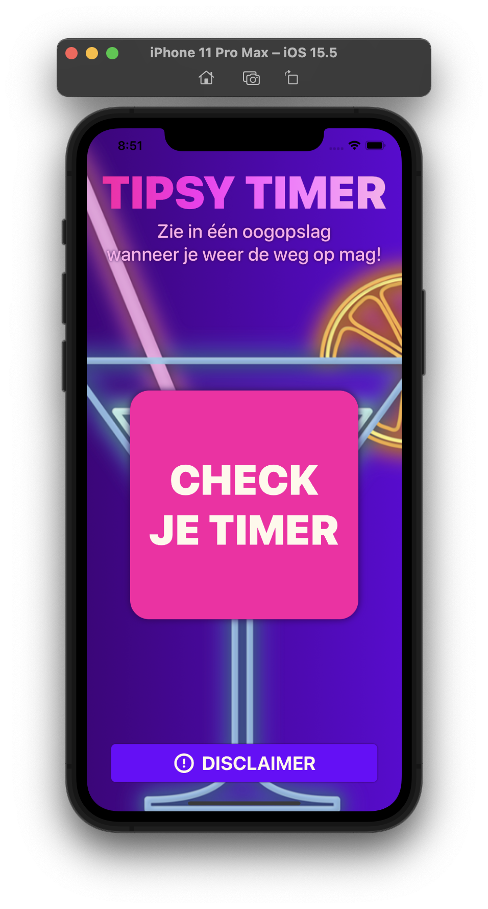

# Tipsy Timer
## Nina Alblas
Ieder jaar stijgt het aantal ongelukken waarbij alcohol in het spel is ([NOS, 2019](https://nos.nl/artikel/2308458-zorgwekkende-toename-aantal-verkeersdoden-door-alcohol-meer-dan-verdubbeld)) en uit zeer recent onderzoek ([SWOV, 2022](https://swov.nl/nl/nieuws/nederlandse-weggebruikers-europees-perspectief-resultaten-van-het-esra2-onderzoek)) blijkt dat 9,1% van de Nederlandse automobilisten met te veel alcohol op achter het stuur stapt. Mensen gaan er vaak onjuist vanuit dat 'die paar drankjes' niet uitmaken, dat de alcohol in hun bloed inmiddels wel afgebroken zal zijn, of dat een kopje koffie ontnuchtert. Deze foutieve aannames kunnen fatale gevolgen hebben.

De applicatie Tipsy Timer zal het aantal beschonken bestuurders helpen verminderen doordat ze de gebruiker aan de hand van een aantal gegevens, waaronder lengte, gewicht en de genuttigde hoeveelheid standaardglazen, toont hoe lang hij nog moet wachten tot de alcohol in zijn bloed is afgebroken en hij weer veilig de weg op kan.

## Doel van deze applicatie
* Vraagt de gebruiker naar een aantal gegevens, waaronder geslacht, leeftijd, lengte en gewicht, en het aantal genuttigde alcoholische consumpties.
* Geeft je de tijd in uren waarna de alcohol in je lichaam in zoverre is afgebroken dat de toegestane BAC is bereikt a.d.h.v. een animatie van een leegdrinkend glaasje met een timer erin
* Timer blijft lopen ook als je app sluit
* Geeft een notificatie als de timer afgelopen is

## Disclaimers
* Geen 18, geen alchol
* Geniet, maar drink met mate
* Vertrouw niet volledig op deze applicatie; laat de beslissing over of je de weg op kunt niet afhangen van het resultaat van je Tipsy Timer
* Naast de gegevens die Tipsy Timer van je vraagt, spelen er ook andere factoren mee bij de absorptie en afbraak van alcohol, zoals drugs- of medicijngebruik, voeding en fysieke conditie
* Rijden onder invloed kan fatale gevolgen hebben; breng jezelf en anderen niet in gevaar
* De Tipsy Timer geeft alleen een schatting van de wachttijd en mag niet worden gebruikt om te bepalen of je nog mag autorijden

*Slagzin: "Zie in één oogopslag wanneer je weer de weg op mag!"*

### Acknowledgements
* GifImage.swift -> Swift and Tips. (2021, August 22). How to display a gif in SwiftUI? [Video]. YouTube. https://www.youtube.com/watch?v=9fz8EW-dX-I
* CurrentUser.swift -> Brick, J. (2006). Standardization of alcohol calculations in research. Alcoholism: Clinical and experimental research, 30(8), 1276-1287.
* DrinkingTimeView.swift & AgeView.swift -> Kavsoft. (2020, September 3). SwiftUI 2.0 Apple Wallet Circular Slider - SwiftUI Circular Slider/Seeker - SwiftUI 2.0 Tutorials [Video]. YouTube. https://www.youtube.com/watch?v=80SHJeeiJ50&list=WL&index=5
* ResultView.swift -> Hudson, P. (2021, September 3). How to show an action sheet. Hacking with Swift. Retrieved June 1, 2022, from https://www.hackingwithswift.com/quick-start/swiftui/how-to-show-an-action-sheet; Prezioso, T. (2021, January 3). How to Make a Phone Call using SwiftUI. Swift Tom. Retrieved June 1, 2022, from https://swifttom.com/2021/01/03/how-to-make-a-phone-call-using-swiftui/; Hudson, P. (2022, January 2). Scheduling local notifications – Hot Prospects SwiftUI Tutorial 8/18 [Video]. YouTube. https://www.youtube.com/watch?v=XnnDHDlPwLw&t=296s; Swiftful Thinking. (2021, April 27). How to use Timer and onReceive in SwiftUI | Continued Learning #24 [Video]. YouTube. https://www.youtube.com/watch?v=ymXRX6ZB-J0&list=WL&index=7&t=872s

* Shared/Gif Image/DrivingJamesBond.gif -> https://giphy.com/gifs/007-UVeVBXJW2EEgMWU7kK
* Shared/Assets/Beer Timer Image/beer-1 -> https://www.pngwing.com/en/free-png-ppffp 
* Shared/Assets/Drink Icons/beer -> https://www.pngwing.com/en/free-png-xqucm/download
* Shared/Assets/Drink Icons/cocktail -> https://www.flaticon.com/free-icon/cocktail_38706
* Shared/Assets/Drink Icons/liquor -> https://thenounproject.com/icon/shot-glass-591392/
* Shared/Assets/Drink Icons/wine -> https://www.pngwing.com/en/free-png-nzylf/download
* Shared/Assets/Experience Icons/confident -> https://www.pngwing.com/en/free-png-vrhra/download
* Shared/Assets/Experience Icons/scared -> https://www.pngwing.com/en/free-png-pwkpy/download
* Shared/Assets/Gender Icons/female -> https://en.m.wikipedia.org/wiki/File:Gender_symbols_side_by_side_solid.svg
* Shared/Assets/Gender Icons/male -> https://en.m.wikipedia.org/wiki/File:Gender_symbols_side_by_side_solid.svg
* Shared/Assets/tipsytimerlogo -> https://www.nicepng.com/downpng/u2e6y3y3e6u2i1i1_neon-drinks-ftestickers-stickers-autocollants-smile-neon-cocktail/
* Shared/Assets/AppIcon -> https://www.nicepng.com/downpng/u2e6y3y3e6u2i1i1_neon-drinks-ftestickers-stickers-autocollants-smile-neon-cocktail/

Alle rechten voorbehouden. 2022.

